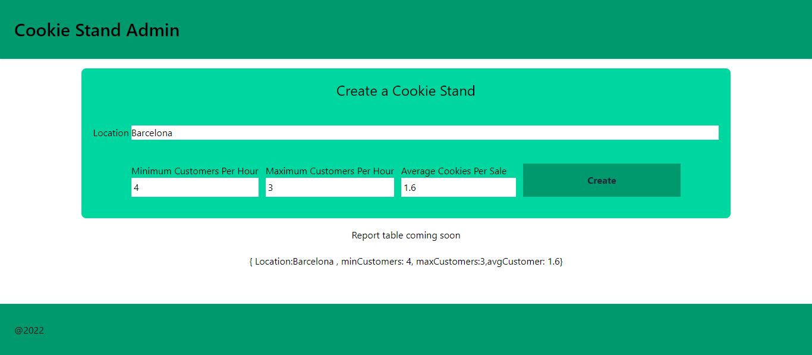
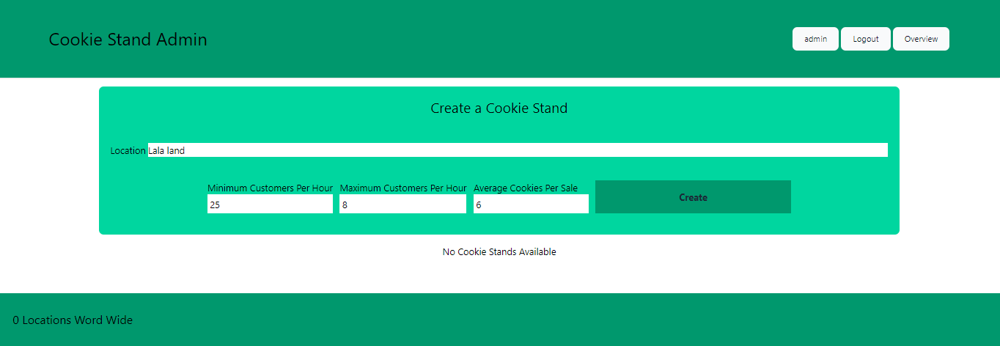
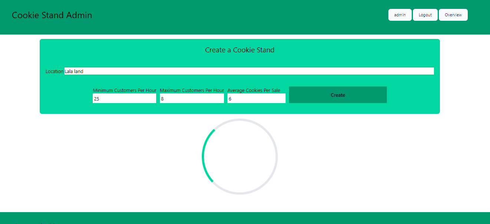
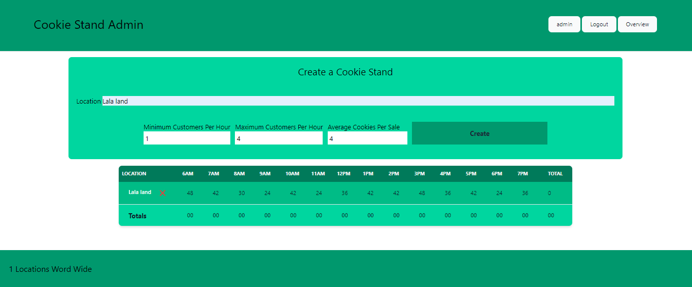
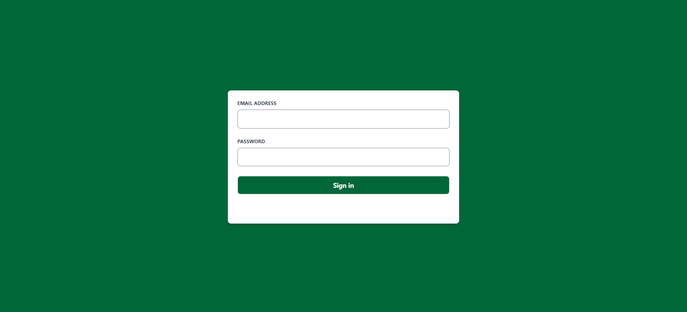

# Getting Started

Run the development server:

```bash
npm run dev
```

Open [http://localhost:3000](http://localhost:3000) with your browser to see the result.



## App V.2

1. 

2. 

3. 

4. 

### Contribut

[Muhammad](https://github.com/muhammadqasemtarboush1)
